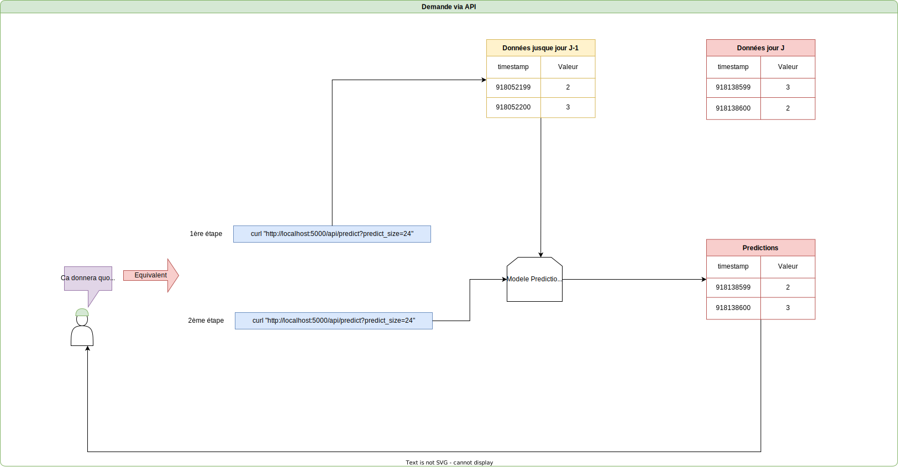
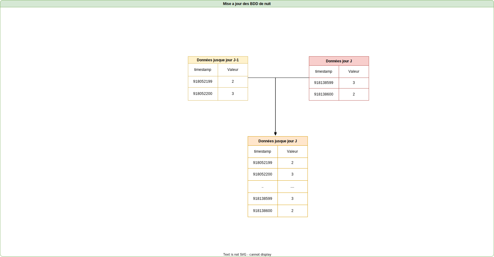
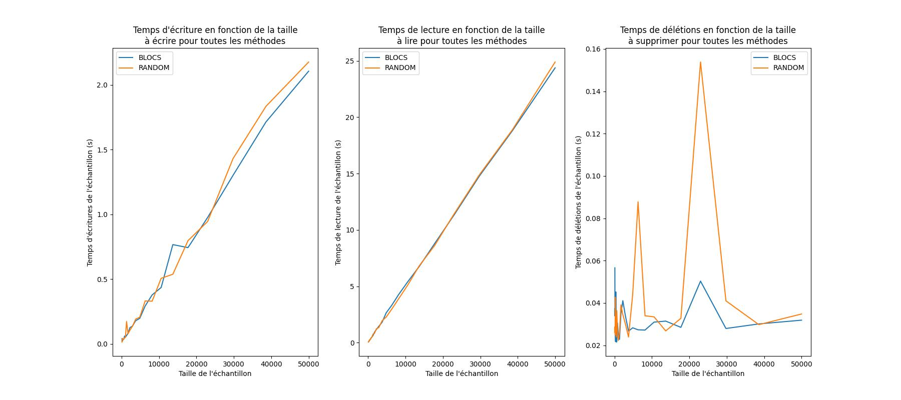
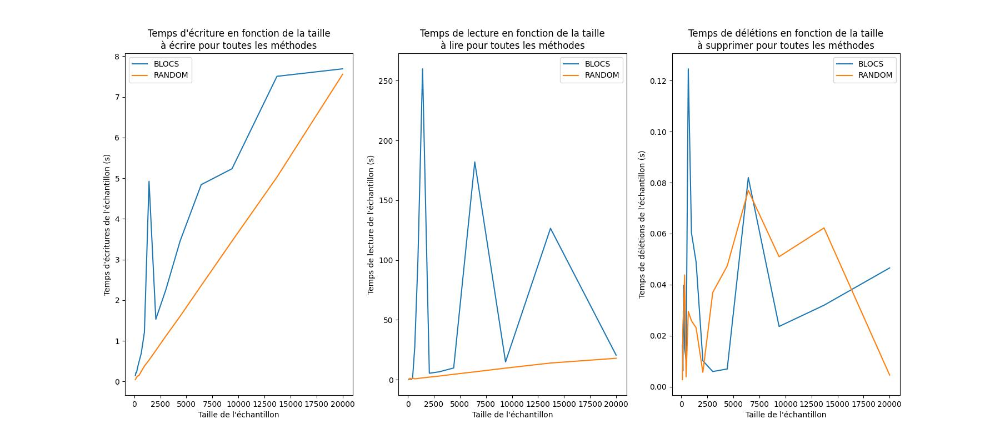
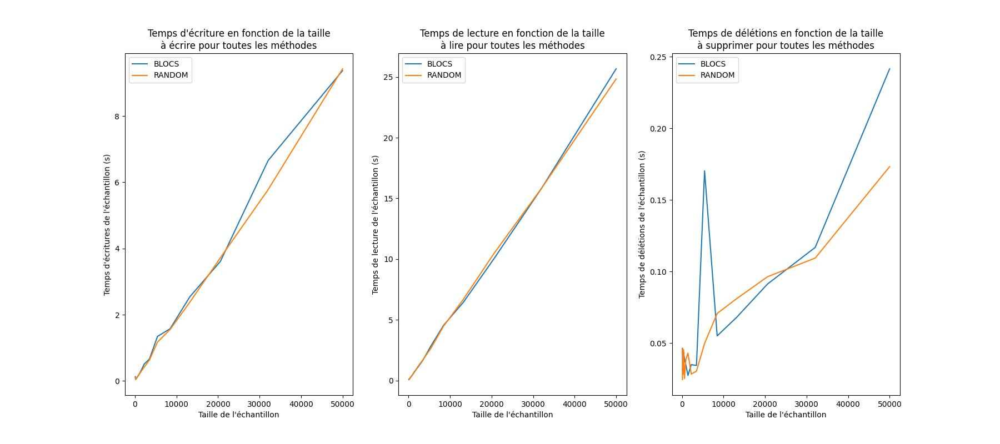
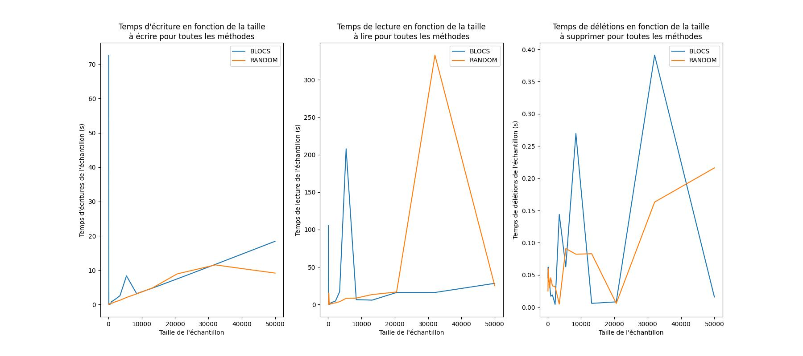
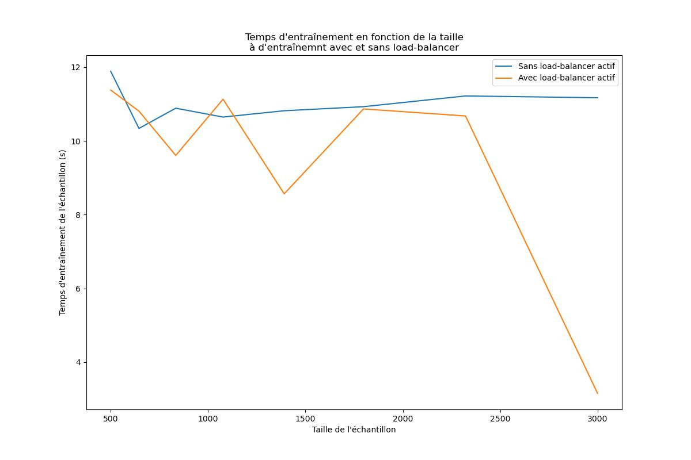

# Projet BDA : Prédictions de séries temporelles à travers une architecture InfluxDB

Binôme : [Nathan LEBLOND](nathan.leblond.etu@univ-lille.fr) & [Simon DECOMBLE](simon.decomble.etu@univ-lille.fr)

**Note :** Le dépôt git qui fait état de la régularité du travail (historique complet des commits) est le [dépôt de TP de Simon](https://gitlab-etu.fil.univ-lille.fr/simon.decomble.etu/bda-22-23/).  

# Introduction 
On s'intéresse ici à mettre à l'épreuve une architecture InfluxDB sur la prédiction de données temporelles.  
Pour cela, nous allons simuler des données temporelles facilement prédictibles, l'objectif étant d'obtenir un grand jeu de données sans la complexité que portent parfois des données réelles.

La sortie attendue de notre algorithme sera une prédiction du futur immédiat des données d'entraînement, en suivant la même granularité temporelle.

L'entraînement et la prédiction pourront être déclenchés à travers une simple API Flask.

*Principe de fonctionnement de l'API*  

*Mise à jour de la BDD durant la nuit non prise en charge par l'application*  

# Problématique
Quelles performances une base de données InfluxDB permet-elle pour le stockage de timeseries et comment est impactée une architecture permettant l'entraînement d'un modèle de machine learning de forecasting ?

1. Jusqu'à quelle limite une BDD InfluxDB permet-elle des performances de lecture/écriture/update acceptables ?
    1. Pour des requêtes sur de grands volumes de données
    2. Pour des écritures/updates ponctuels 
    3. Pour des actions en concurrence

2. Comment est impacté notre modèle de machine learning pour différents volumes à traiter sur la BDD ?
    - Temps d'entraînement

3. Comment mettre en place une redondance des données sur InfluxDB ?

# Démarche globale
- Créer un générateur de fausses données : des timestamps simulées et pour chacune une valeur de métrique. On créé ces points à partir d'une fonction relativement simple : la somme de deux sinusoïdes de périodes différentes, à laquelle on ajoute un bruit gaussien.

- Définir et déployer 2 architectures d'instances influxDB

## Partie 1
- Bencher les temps de lecture / écriture / délétion (**L/E/D** dans la suite) à mesure qu'on augmente la volumétrie concernée par ces opérations et comparer entre architectures

## Partie 2
- Injecter la volumétrie maximale (établie) de données dans notre architecture
- Etablir un modèle de forecast ARIMA, accessible via API
- Bencher le temps d'entraînement du modèle à mesure qu'on augmente la volumétrie de train et comparer entre architectures

# Architectures comparées
L'architecture 1 est basique : nous avons monté une base InfluxDB sur la VM nommée `BDA1` dans la suite.  
Cette base est unique, sans mécanisme d'indexation particulier, sans configuration particulière non-plus. 

L'architecture 2 est constituée de 3 noeuds influxDB qui contiennent tous l'intégralité des données. Devant ces 3 noeuds, nous plaçons éventuellement un mécanisme custom de load-balancing (les options de clusterisation étant payante pour influxDB). Le choix exact de cette archi a été effectué au cours de la démarche après les résultats de la 1ere architecture.

# Facteurs de variation dans les évaluations
Au-delà de comparer les résultats d'une architecture à l'autre, nous présentons des résultats en faisant varier :
- la manière d'interagir avec la base :
    - `BLOCS` : actions par bloc de temps contigus
    - `RANDOM` : actions par blocs rangés par date aléatoire
- la présence ou non de processus concurrent pour la réalisation d'interactions avec la base

# Evaluation des architectures 
## 1. Evaluation selon le temps de L/E/D
### Principe
L'objectif est principalement d'être en mesure de comparer les perfomances de lecture dans la base de données en partant du principe que le coeur de l'application serait de venir consulter les données pour réaliser des prédictions. Néanmoins, pour ne pas biaiser les mesures nous purgeons la base entre chaque lot de lecture, nous avons ainsi l'occasion de mesurer également les temps d'écriture et de délétions. 

Pour rappel, l'objectif de notre modèle est de pouvoir prédire un laps de temps donné dans le futur vis à vis des données stockées. Pour des questions de simplicité, de faible coût mémoire et temporel et puisque le signal prédit est relativement peu complexe, on se limitera à 50 000 points maximum dans les bases.

Nous allons mesurer les temps d'écriture, de lecture et de délétions pour des injections de plus en plus grande jusque 50k lignes.  

### Architecture 1 : noeud unique
#### Benchmarks
##### Process sans concurences
Ici, le process est lancé seul, sans aucune autre interaction concurrente avec BDA1.

L'écriture par bloc croissant de 10 à 50 000 lignes dans la base influxDB donne des vitesses de lectures et d'écriture linéaire avec la taille des données, on ne constate pas de ralentissement à ces ordres de grandeurs. Le temps de délétion est quand à lui constant sur toute la bande de données étudiée.  
Ces conclusions valent pour les 2 méthodes, aléatoire et par blocs contigus.  

*Benchmarks de l'architecture 1 avec un processus seul*  
  

##### Process avec concurences
Ici, le process est lancé en concurrence avec 9 autres qui vont chercher à réaliser les mêmes actions de L/E/D avec les deux méthodes.  

On voit que lors du tir, la méthode par blocs de temps contigus donne des temps d'écriture et de lecture très variable, ne dépendant plus uniquement de la taille des données, notamment, on voit que pour 2000, on a mis environ 4 fois plus de temps à écrire que pour 2500 et 10 fois plus pour lire.  
Les temps de déletions semblent cependant moins sensibles à la concurrence. 

Pour la méthode aléatoire, en revanche, on voit que la linéarité avec la taille des données reste respectée pour l'écriture et la lecture avec un comportement similaire pour la déletion.  

Pour expliquer ces résultats, on précise que nous n'avons pas fixé de seed lors de nos tirs. Ainsi, on suppose que dans la méthode d'écriture par blocs, les 10 processus étant lancés en parallèle au même moment, ils cherchent à écrire approximativement les mêmes lignes de la TSDB au même moment, rencontrant alors différents mécanismes de lock pour assurer la cohérence des données. Cela conduit nécessairement à des ralentissements.  
En revanche, la méthode aléatoire n'étant pas "seedée", on imagine que les 10 processus vont se lancer dans des L/E/D de même ordre de grandeur mais sur des lignes différentes la très grande majorité du temps.  

*Benchmarks de l'architecture 1 avec 10 processus concurrents*

#### Conclusion sur l'architecture 1
Etant donné les résultats du second tir, nous voyons que cette architecture seule ne permet pas d'assurer la scalabilité de l'application finale puisque le temps de lecture augmente ici de façon anarchique avec le nombre de sessions concurrentes.  

Etant donné la structure de nos données, il ne semble pas pertinent de réaliser une distribution des données par clef très poussée. En effet, puisque la nature du problème implique nécessairement d'accéder à une grande quantité de données contigues, il serait insensé de ne pas laisser les blocs de temps ensemble. Seulement, puisque la méthode aléatoire semble indiquer que les temps de lectures ne sont pas impactés si l'on accède a des blocs différents, distribuer les blocs de temps sur différentes BDD ne permettrait en théorie peu ou pas d'amélioration.

Pour remédier à ce problème, il faudrait être en mesure de multiplier la BDD pour permettre de répartir la lecture des blocs.  
Nous allons ici chercher à créer 2 répliques pour former un cluster de 3 BDD, chacune possédant toutes les données. 
Dans notre cas d'étude, nous nous intéressons principalement à la disponibilité des données pour la lecture, en imaginant que **les processus d'écriture et de délétions seraient gérés par une autre application**.  

### Architecture 2 : 3 noeuds et load-balancer
En réponse au problème observé précédemment, nous avons monté un cluster de 3 VMs hébergeant une instance InfluxDB. Nous implémentons un load-balancer naïf et glouton (on traite les requêtes à leur arrivée en faisant le meilleur choix selon le contexte local actuel).

Le travail de cette application minimaliste est de diriger les requêtes de lecture vers l'instance qui permettra de minimiser la charge instantannée, i.e. les chevauchements temporels avec de précédentes requêtes en cours sur cette instance.   

#### Benchmarks
##### Sans concurrence
Avec un seul processus et le load-balancer placé devant les BDD, on voit que nous atteignons toujours les mêmes performances d'écriture et de lecture linéaires avec la taille des données.

C'est le comportement attendu étant donné que le processus seul sera toujours renvoyé sur la 1ère BDD par le load-balancer, en pratique, on peut confirmer que le load-balancer n'introduit pas de biais en tant que tel dans les performances mesurés. Nous rajoutons que les étapes passant par le load-balancer (choix de la BDD, écriture des bandes temporelles actuellement requétées, délétions des bandes temporelles actuellement requétées) ne sont jamais incluses dans les chronométrages. 

*Benchmarks Architecture 2 sans concurrence*  

##### Avec concurrence
Avec 10 processus concurrents, en plaçant le load-balancer devant le même script de benchmarks utilisé dans l'architecture 1, nous pouvons voir que lorsque les ordres de grandeur sont assez grands, on parvient à réatteindre des temps de lectures linéaires avec la taille des données. En effet, pour des ordres grandeur élevés, les processus se sont déjà desynchronisés (aux faibles ordres de grandeur). Ainsi, en étant répartis de manière à limiter les chevauchements, bien que l'on ait plus de processus que de BDD, on ne voit plus de ralentissement apparaître car les process ont un offset dans la lecture de leur intervalles.  
Pour appuyer cette explication, nous voyons que pour les petits ordres de grandeurs, tous les processus essaient à nouveau de venir taper les mêmes lignes dans la BDD ce qui provoque de nombreux ralentissement et notamment la desynchronisation des processus.  

**Remarque pour la méthode "RANDOM"** : la répartition effectuée par le load-balancer ne permet pas de limiter les chevauchements car, même desynchronisés, les processus n'ont aucune assurance de ne pas taper les mêmes lignes de la BDD au même moment étant donné que nous n'avons pas définie de graine aléatoire.

En conclusion, nous voyons grâce à ce tir que dans notre cas d'utilisation (lecture par blocs de temps contigus) avec des processus parallèle potentiellement sur des intervalles de temps se chevauchant, le load-balancer permet de rétablir le temps de lecture linéaire constaté sans concurrence. Néanmoins, nous n'avons pas benché le nombre de processus concurrent maximal pour rester en temps linéaire, nous sommes limités par les capacités de nos middlewares qui ne peuvent pas supporter en RAM l'intégralité des données que cela représenterait. On se retrouverait finalement à traverser plusieurs niveaux de couches mémoires lorsque le nombre de processus concurrents serait trop grand, ce qui biaiserait le tir de l'architecture.  

Nous aurions également pu nous contenter d'une structure de données globale pour une BDD qui stockerait les têtes de lectures courantes des requêtes actuellement présentées à la BDD et provoquer un retard des nouvelles requêtes qui souhaiterait interroger ces mêmes têtes de lectures pour assurer des temps de lecture linéaires. Le temps de retard à accorder pouvant sûrement venir contrebalancer la multiplicité des lock/unlocks. Néanmoins, cela représenterait un retard conséquent pour le dernier arrivant en cas de nombreuses requêtes concurrentes sur un faible intervalle de temps. 

*Benchmarks Architecture 2 avec concurrence*  

## 2. Evaluation selon le temps d'entraînement du modèle
### Principe
Finalement, nous présentons les résultats de l'utilisation finale cohérente de notre application. Nous évaluons le temps d'entraînement car nous supposons dans notre cas d'apprentissage offline qu'il y a réentraînement régulier sur les X données les plus récentes.  
Nous benchons les temps d'entraînements moyens via l'API avec 8 processus concurrents avec et sans load-balancer (i.e. le load-balancer renvoie systématiquement vers la même BDD).  

### Benchmark
Nous pouvons confirmer les observations faites sur le tir avec le load-balancer, pour de petits échantillons d'entraînement, nous ne voyons pas de différence significative via l'utilisation du load-balancer. Cela car tous les processus sont synchronisés et terminent très rapidement les premières lectures. Ainsi, malgré les efforts du load-balancer pour limiter les chevauchements, ceux-ci se produisent nécessairement puisque nous avons plus de processus synchronisés que de BDD sur lesquelles équilibrer le flux.

Une fois les plus grands échantillons atteints, on voit une nette amélioration des temps d'entraînement. Pour des ensembles d'entraînement supérieurs à 3 000 éléments, on parvient à diviser par 3 le temps moyen d'entraînements.  

*Benchmarks Architecture 2 prédiction avec concurrence avec et sans load-balancer*  

# Discussion
- Notre architecture occulte la gestion de l'ACIDité de nos BDD en considérant que les phases d'écritures et de mise à jour ne se feront pas au même moment.

- D'autres stratégies de load-balancing auraient pu être prise en compte, comme une comparaison avec du round-robin qui pourrait permettre de répartir plus équitable la charge de calcul.    
- Le benchmark du temps d'entraînements au regard du load-balancing se contente d'un `sleep` pour resynchroniser les processus entre les deux phases (avec/sans load-balancer).
- Notre load-balancer garde une structure de donnée globale interne au process, l'idéal serait d'en déployer N, en actif passif, en utilisant une structure légère telle que SQLite pour gérer en local une structure commune aux process. Les N-1 process passifs auraient ainsi la capacité de prendre le relais de l'actif si celui-ci plante tout en minimisant les dégats.
- En guise d'élargissement, nous aurions pû bencher une métrique d'évaluation de prédiction : e.g. l'accuracy.

# Conclusion

Au regard des expérimentations réalisées, nous pouvons conclure que la version gratuite native d'InfluxDB 2.5 permet difficilement une montée en charge de notre application, sans mécanisme supplémentaire.

Pour ce qui est des performances d'écriture, nous sommes en mesure d'y écrire de grande quantité de données dans des temps raisonnables si nous ne rencontrons pas de concurrence. Ce qui est un avantage au regard des choix techniques effectués dans l'architecture 2. Ces performances peuvent en effet permettre de réaliser des mécanismes naïfs de réplications des données dans des temps raisonnables.

Concernant la solution apportée pour permettre une montée en charge modérée sur notre plateforme, nous voyons que le load-balancer permet, d'après nos expérimentations, de réduire le temps de lecture moyen lorsque notre infrastructure est soumise à un grand nombre de requêtes concurrentes. Ainsi, comme démontré, le load-balancer permet de diviser les temps d'entraînements pour le modèle. 
Etant donné que dans notre choix technique le modèle nécessite obligatoirement un réentraînement lorsque l'on change de fenêtre temporelle, cette optimisation est utile.  

Ainsi, en conclusion à notre problématique:  
1. Jusqu'à 50 000 lignes à la fois, les performances de lecture/écriture sont linéaires dans la taille des données s'il n'y a pas d'autres processus, la délétion se fait en temps quasi-constant. Dans notre cas, cela représente 2h de données à une granularité de 10 secondes. Dans des modèles comme ARIMA, pour la saisonnalité et la tendance simulée, cela est largement suffisant. Des performances tout à fait acceptables sont constatées dans d'autres matières avec 1 point par heure, ce qui, pour 50 000 points, correspond à 5 ans et 8 mois.

2. On voit que notre modèle est de plus en plus long à s'entraîner avec la taille de l'ensemble d'entraînement et qu'il va nécessairement requêter des tailles de plus en plus grandes dans les tables, cela entraîne donc des chevauchements avec d'autres requêtes. Ainsi, nous voyons que lorsque l'on augmente le volume de données à traiter, si le nombre de processus grandit trop, alors l'augmentation du temps d'entraînement n'est plus linéaire avec le volume des données.  

3. De par les limitations de licence, la réplication de nos données n'est assurée que par une réecriture des données dans les trois bases, cependant notre mécanisme de load-balancing va permettre d'équilibrer au maximum la charge de chevauchement des têtes de lecture entre ces 3 BDD pour limiter au maximum les collisions de processus.  

# Annexe A : justification des choix techniques
## BDD : InfluxDB
Nous voulions traiter d'une TSDB et nous avions déjà croisé cette technologie dans un contexte professionnel sans s'attarder sur sa gestion ou son utilisation. La version utilisée est la 2.5.0 car il s'agit de la dernière stable en date et bien adaptée à l'API Python utilisée.

## API HTTP : Flask
Il s'agit d'un framework intuitif et rapidement déployable déjà utilisé auparavant.  

## Modèle de forecast : ARIMA
Modèle classique de time forecasting simple d'utilisation. Nous avions hésité avec XGBoost qui a des performances state-of-the-art mais moins souple. Ne sachant pas jusqu'où il faudrait adapter notre modèle et en voulant garder une approche KISS, nous nous sommes dirigé vers ARIMA.

# Annexe B : Difficultés rencontrées
- Initialement, s'adapter au paradigme TSDB : bucket, organisation, métrique etc. ainsi que les interactions avec influxDB (via API, CLI, shell), incompatibilités parfois.  

- Estimer la quantité de données maximale qu'on aurait dans les bases de données : nous voulions faire une étude sur 5M de points mais nous avons dû nous limiter à 50k maximum à cause de problèmes de RAM sur les middles et de durées des calculs. Nous avons envisagé l'utilisation de stream et d'apprentissage incrémental, mais cela rajoutait de la complexité technique au projet. Les résultats étant très satisfaisant tel quel, nous n'avons donc pas augmenté la volumétrie.

# Annexe C : Documentation technique
Voir le fichier [de documentation technique](documentation.md)`.
